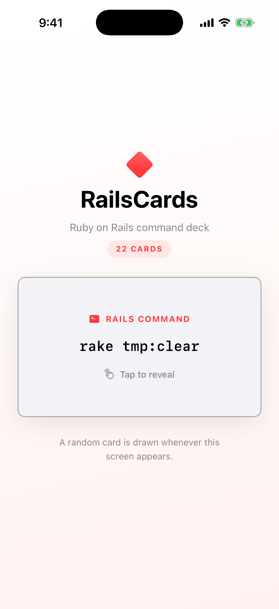
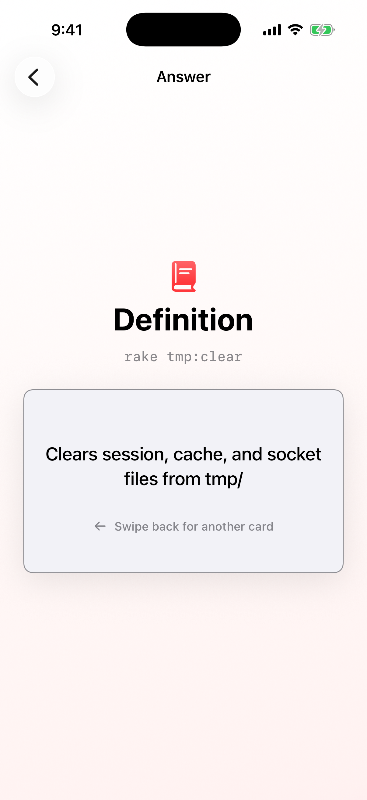

# RailsCards - Lab 02

**Platform used: Swift (SwiftUI)**

RailsCards is a flashcard app for learning common Ruby on Rails and Rake commands. Tap a command card to reveal its definition. Returning to the command screen draws another random card.

## Features

- 22 Ruby on Rails, Rake, Gem, and Bundler command cards
- Command and definition screens connected with `NavigationStack`
- Random card selection whenever the command screen appears
- MVVM organization using `Models`, `ViewModels`, and `Views`
- Modern Observation framework with `@Observable`
- Five passing unit tests written with Swift Testing

## Screenshots

| Command | Definition |
| --- | --- |
|  |  |

## Project structure

```text
RailsCards/
├── Models/
│   ├── Deck.swift
│   └── Flashcard.swift
├── ViewModels/
│   └── CardViewModel.swift
├── Views/
│   ├── CardView.swift
│   └── DefinitionView.swift
└── RailsCardsApp.swift

RailsCardsTests/
├── CardViewModelTests.swift
└── DeckTests.swift
```

## Run the app

1. Open `RailsCards.xcodeproj` in Xcode.
2. Select an iPhone simulator running iOS 17 or later.
3. Run the app with **Cmd + R**.
4. Run all tests with **Cmd + U**.
